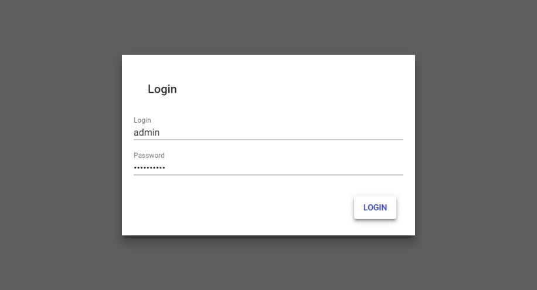
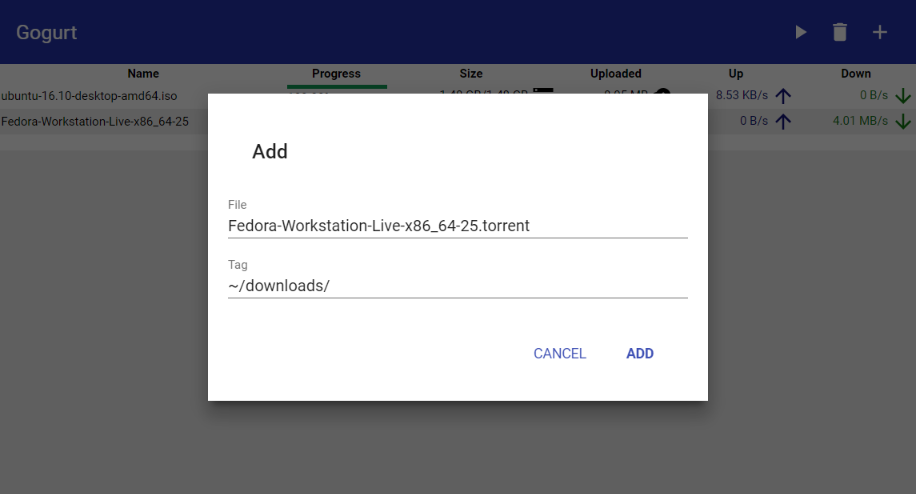
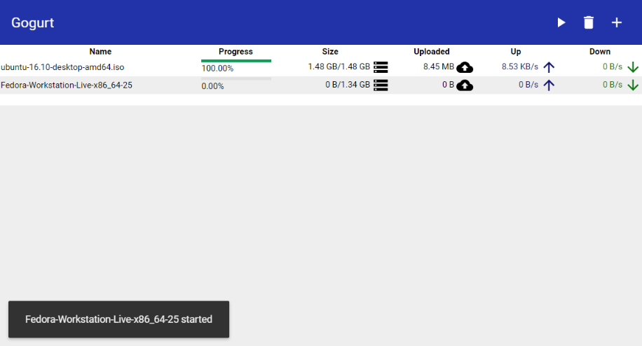

# gogurt

Light responsive rtorrent web-gui

Uses JWT for authentication, and will generate a new key (and password) on each launch, if not provided on the command line.

The **server** part only serves the webresources and acts as a REST server, which allows to implement any WebUI/control apps/scripts on top.

## Screenshots

Login dialog:



Adding a torrent into the queue:



Overview:



## Dependencies:

- For JWT [github.com/dgrijalva/jwt-go](https://github.com/dgrijalva/jwt-go)
- For handling web requests [github.com/gin-gonic/gin](https://github.com/gin-gonic/gin)
- For parsing XMLRPC [github.com/kolo/xmlrpc](https://github.com/kolo/xmlrpc)
- For client-side webgui [https://www.polymer-project.org/1.0/](https://www.polymer-project.org/1.0/)

## To build:
In root source folder:

`go build`

In **webroot**:

`bower install`

## Command line parameters:

```
Usage of ./gogurt:
  -host string
        HOST to bind to (default "localhost")
  -password string
        Password used for logging in (default "random")
  -port uint
        PORT to listen on (default 9999)
  -rpc string
        rtorrent scgi socket (default "127.0.0.1:5000")
  -username string
        Username used for logging in (default "admin")
```

For connecting to rtorrent via local unix socket simply specify the path to -rpc as e.g. `/tmp/rtorrent.sock`

## TODO:

- [X] Add screenshots to README
- [ ] Support config file and bundled polymer resources
- [ ] Support SSL
- [ ] Add config wizard?
